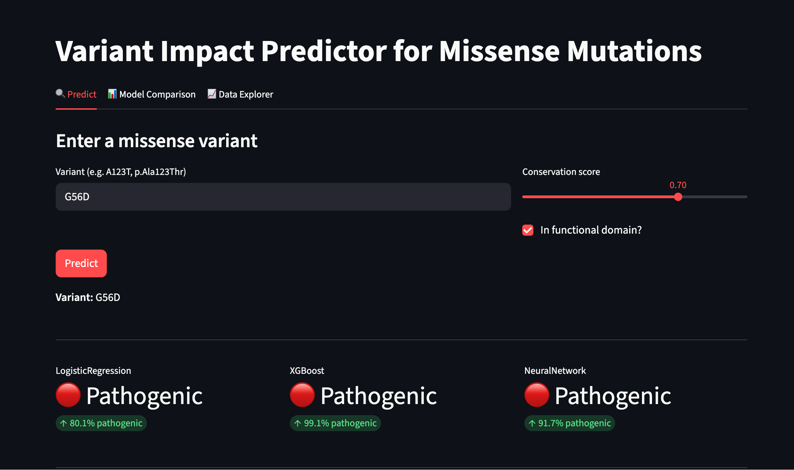
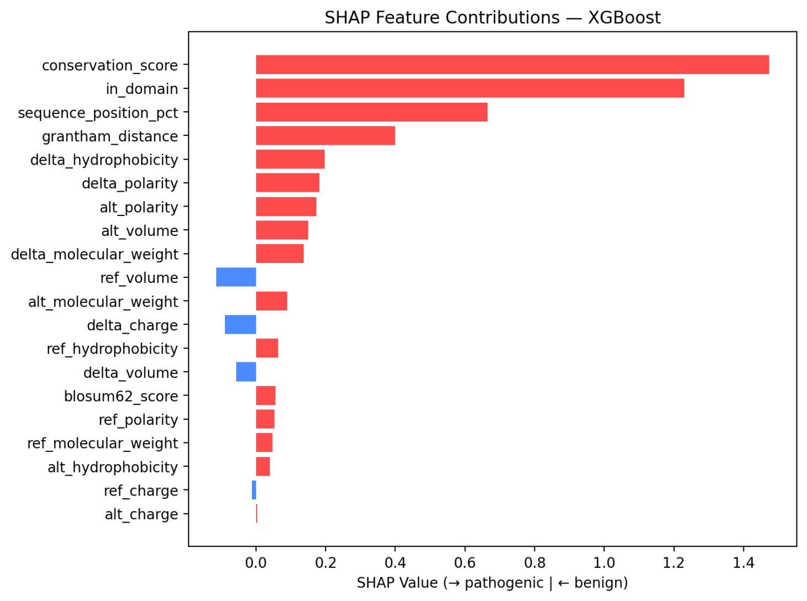

# VariantScope: Variant Impact Predictor for Missense Mutations

A bioinformatics ML pipeline that predicts whether protein-coding missense
mutations are likely **benign** or **damaging** using sequence, structure,
and evolutionary features.

## Features

- **20 biologically meaningful features** per variant (Grantham distance,
  BLOSUM62, physicochemical properties, conservation, domain annotations)
- **3 models compared**: Logistic Regression, XGBoost, PyTorch Neural Network
- **SHAP explainability** for every prediction
- **Self-contained** synthetic dataset that mimics ClinVar distributions

## Quick Start

```bash
# 1. Install dependencies
pip install -r requirements.txt

# 2. Run the full pipeline (trains + evaluates)
python pipeline.py

# 3. Launch the Streamlit demo
streamlit run app.py

# 4. Run tests
pytest tests/ -v
```
## Demo

<p align="center">
  
  <br>
  <em>Interactive Streamlit interface for variant prediction</em>
</p>

<p align="center">
  
  <br>
  <em>SHAP values highlighting key biological features</em>
</p>